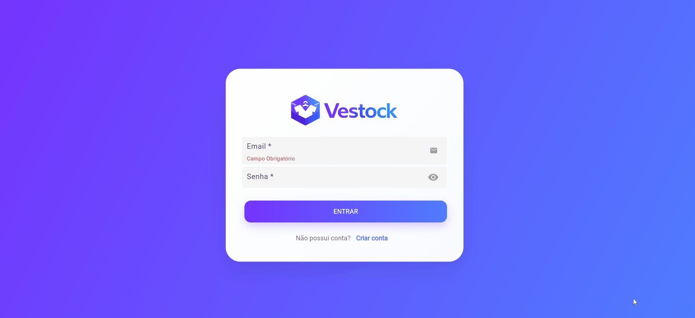

<h1 align="center">👚 Vestock 🛍️</h1>

Vestock é um sistema de gestão para lojas de vestuário que unifica o controle de produtos, clientes, fornecedores, funcionários, vendas e estoque em uma solução Flutter com backend Java

## Funcionalidades implementadas

- 🧾 Cadastro e edição de produtos com atributos completos
- 👥 Cadastro e edição de clientes
- 👤 Cadastro e edição de funcionários
- 🏬 Cadastro e edição de fornecedores
- 🔒 Autenticação de loja com email e senha
- 💳 Registro de vendas com cliente, funcionário, itens, totais e forma de pagamento
- 💸 Aplicação de cupons e descontos percentuais em vendas
- 📦 Atualização automática do estoque após vendas
- 📅 Registro de vendas em modalidade condicional com retirada e devolução
- 🔁 Marcação de devolução de condicionais
- 📱 Tela de detalhes da loja logada
- 🌙 Modo noturno
- 📐 Interface responsiva para diferentes plataformas

## 🎥 Preview Desktop

<p align="center">
  
</p>

## 🎥 Preview Mobile

<p align="center">
  
</p>


## Requisitos Funcionais

| Código | Descrição |
|----------|------------|
| RF01 | Cadastro de produtos contendo código, nome, tamanho, cor, tipo, preço de custo, preço de venda, quantidade em estoque, fornecedor, descrição e data de cadastro. |
| RF03 | Cadastro de clientes contendo código, nome, CPF, telefone, e-mail, endereço e data de cadastro. |
| RF04 | Cadastro de funcionários contendo código, nome, CPF, cargo, data de admissão, telefone, e-mail e endereço. |
| RF06 | Cadastro de fornecedores contendo código, CNPJ, razão social, e-mail, telefone e endereço completo. |
| RF07 | Registro de vendas com cliente, funcionário, produtos, quantidades, preços, valor total e forma de pagamento. |
| RF09 | Controle de cupons de desconto vinculados a campanhas promocionais. |
| RF10 | Atualização automática do estoque após a realização da venda. |
| RF11 | Registro de vendas em modalidade condicional com data de retirada e devolução. |
| RF12 | Controle de devolução dos itens condicionais. |
| RF13 | Cadastro de loja com nome da empresa, CNPJ, telefone, rua, bairro, cidade, email e senha |

## Arquitetura do projeto

- `backend/` - API Java + Spring Boot organizada em camadas:
  - Controllers: expõem rotas REST e formatação de resposta JSON
  - Services: encapsulam regras de negócio e validações
  - Repositories: persistência e acesso a dados via Spring Data JPA
  - Models: entidades de domínio e objetos de transferência de dados
- `front/` - Aplicativo Flutter com suporte a Flutter Web, mobile e desktop
- `banco/` - Scripts e modelo relacional do banco

## Design Patterns aplicados

- Repository: usado pelo backend com Spring Data JPA (`Repository` interfaces) para separar persistência da lógica de negócio.
- Service Layer: serviços (`*Service`) isolam regras de negócio e coordenam operações entre controllers e repositórios.
- Dependency Injection: Spring injeta controllers e serviços automaticamente, garantindo baixo acoplamento e fácil testabilidade.


## 🛠️ Tecnologias Utilizadas

### **Backend**
- ☕ **Java 21**
- 🌱 **Spring Boot 4**
- 🗂️ **JPA / Hibernate**
- 📦 **Maven**

### **Banco de Dados**
- 🐘 **PostgreSQL**
- 🛠️ **DBeaver**
- 🖥️ **pgAdmin**

### **Frontend**
- 🌐 **Flutter**
- ⚙️ **Dart SDK 3.10.1**
- 🎀 **Packages: `http`, `shared_preferences`, `intl`, `flutter_slidable`, `awidgets`**
  
### **Ferramentas de Desenvolvimento**
- 🖥️ **Eclipse**
- 📝 **VS Code / Android Studio**
- 🔧 **Git**
- 🌐 **GitHub**

## Como executar

### Backend

1. Configure o PostgreSQL.
2. Atualize `backend/src/main/resources/application.properties` com URL, usuário e senha do banco.
3. Abra o terminal em `backend/`.
4. Execute:

```powershell
./mvnw spring-boot:run
```

### Frontend

1. Abra o terminal em `front/`.
2. Execute:

```powershell
flutter pub get
flutter run
```

> Observação: se estiver usando dispositivo físico ou emulador, verifique o `ApiService.baseUrl` em `front/lib/services/api_service.dart` para apontar para o backend correto.

## 👨‍💻 Desenvolvedores

<table>
  <tr>
    <td align="center">
      <a href="https://github.com/maiarakothe" style="text-decoration: none; color: inherit;">
        <br>
        <strong>Maiara Braun Kothe</strong>
      </a>
    </td>
    <td align="center">
      <a href="https://github.com/MatheusBamberg" style="text-decoration: none; color: inherit;">
        <br>
        <strong>Matheus Scherer Bamberg</strong>
      </a>
    </td>
    <td align="center">
      <a href="https://github.com/Zilles09" style="text-decoration: none; color: inherit;">
        <br>
        <strong>Moisés Augusto Braun Zilles</strong>
      </a>
    </td>
    <td align="center">
      <a href="https://github.com/eric-camini482" style="text-decoration: none; color: inherit;">
        <br>
        <strong>Eric Camini</strong>
      </a>
    </td>
  </tr>
</table>
